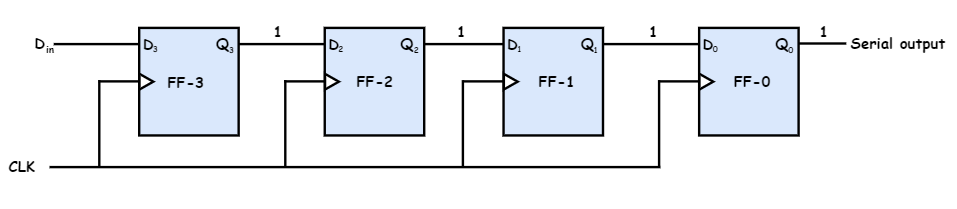
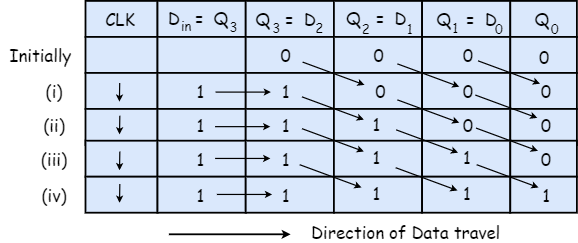
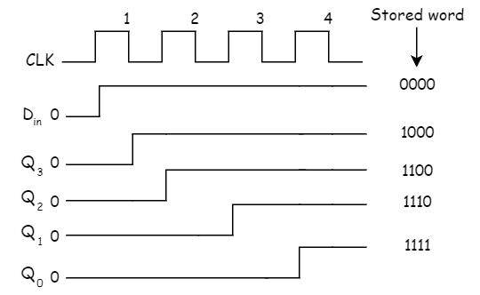

# Serial Input Serial Output
{: .no_toc }

## Table of contents
{: .no_toc .text-delta }

1. TOC
{:toc}

---

## Introduction

Serial Input Serial Output shift register is divided into two types. They are:
1. Shift right mode
2. Shift left mode

Let outputs of all flip flop be equal to 0 i.e. Q3 = Q2 = Q1 = Q0 = 0. To explain the working of Serial input Serial output shift register, let us take a scenario where we should store a four bit binary number 1 1 1 into the register. The first step is to locate the LSB ( in this case it is '1'). The number should be applied to Din with the LSB bit applied first. The D input of FF-3 i.e. D3 is connected to serial data input Din. Output of FF-3 i.e. Q3 is connected to the input of the next flip-flop i.e. D2 and so on.
The circuit given below represents the shift right mode as the data is input to the left flip flop and the stored value is shifted to the right.

## Block Diagram

## Operation

Before the application of clock signal, let Q3 Q2 Q1 Q0 = 0000 and LSB bit of the number is given to Din. So Din = D3 = 1. Apply the clock. On the first falling edge of the clock, the FF-3 is set, and stored word in the register is Q3 Q2 Q1 Q0 = 1000.

Apply the next bit to Din. So Din = 1. As soon as the next negative edge of the clock hits, FF-2 will set and the stored word changes to Q3 Q2 Q1 Q0 = 1100.

Apply the next bit to be stored i.e. 1 to Din. Apply the clock pulse. As soon as the third negative clock edge hits, FF-1 will be set and the stored word changes to Q3 Q2 Q1 Q0 = 1110.

Similarly with Din = 1 and with the fourth negative clock edge arriving, the stored word in the register is Q3 Q2 Q1 Q0 = 1111.

## Truth Table

## Waveforms

