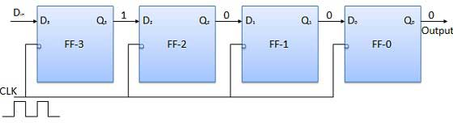
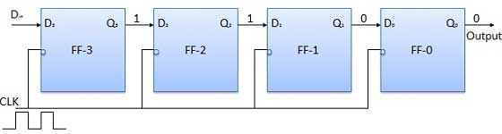
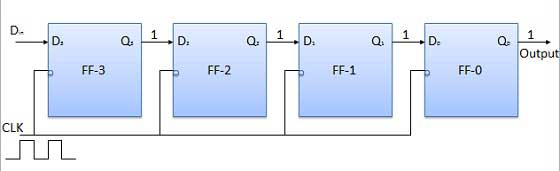
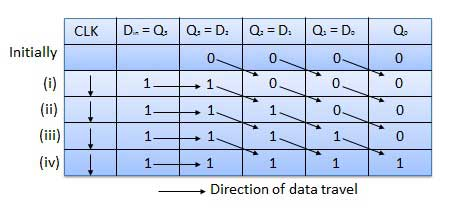
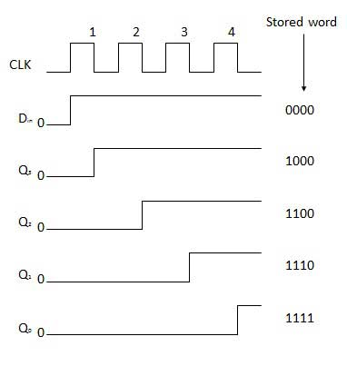

# Serial-in serial-out
{: .no_toc }
 

## Table of contents
{: .no_toc .text-delta }

1. TOC
{:toc}

---

## Introduction
 
Let all the flip-flops be initially in the reset condition i.e. Q3 = Q2 = Q1 = Q0 = 0. If an entry of a four-bit binary number 1 1 1 1 is made into the register, this number should be applied to Din bit with the LSB bit applied first. The D input of FF-3 i.e. D3 is connected to serial data input Din. The output of FF-3 i.e. Q3 is connected to the input of the next flip-flop i.e. D2, and so on.

## Block diagram

## Operation

Before application of the clock signal, let Q3 Q2 Q1 Q0 = 0000 and apply the LSB bit of the number to Din. So Din = D3 = 1. Now, apply the clock. On the first falling edge of the clock, the FF-3 is set, and stored word in the register is Q3 Q2 Q1 Q0 = 1000.

Apply the next bit to Din. So Din = 1. As soon as the next negative edge of the clock gets triggered, FF-2 will set and the stored word change to Q3 Q2 Q1 Q0 = 1100.

Apply the next bit to be stored i.e. 1 to Din. Apply the clock pulse. As soon as the third negative clock edge gets triggered, FF-1 will be set and output will get modified to Q3 Q2 Q1 Q0 = 1110.

Similarly with Din = 1 and with the fourth negative clock edge arriving, the stored word in the register is Q3 Q2 Q1 Q0 = 1111.

## Truth table

## Waveforms

<iframe width="100%" height="400px" src="https://circuitverse.org/simulator/embed/93866" id="ss_01" scrolling="no" webkitAllowFullScreen mozAllowFullScreen allowFullScreen> </iframe>

