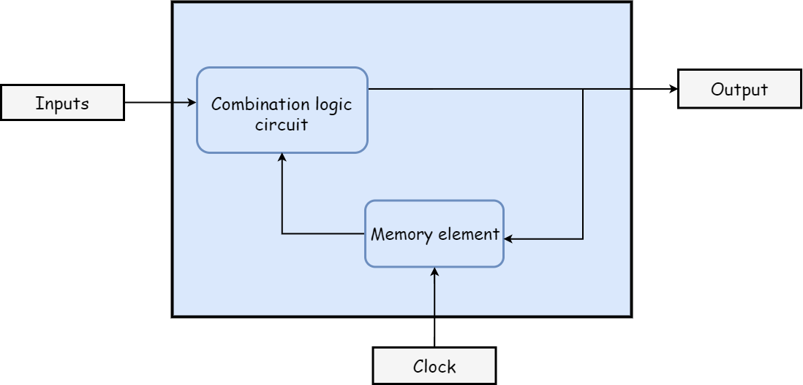

# Digital Sequential Circuits
{: .no_toc }

The digital circuits that have been discussed in the previous modules were called Combinational circuits.
In this module, we will learn about Sequential circuits.

A block diagram of a sequential circuit is shown below. 

This sequential circuit contains a set of inputs and output(s). 
The information stored in a sequential circuit represents the present state.
The output(s) of sequential circuit depends on the present input as well as present state(past output).
Sequential circuits is a combinational circuits with memory (storage) elements. 
  Examples: Flip-flops,registers,counters.  
There are some sequential circuits which do not contain combinational circuits, but only memory elements.

Following table shows the **differences** between combinational circuits and sequential circuits.

|   Combinational Circuits    |    Sequential Circuits     |
|:----------------------------|:---------------------------|
|Outputs depends only on present inputs.|Outputs depend on both present inputs and present state (past output).|
|Feedback path is not present.|Feedback path is present.|
|Memory elements are not required.|Memory elements are required.|
|Clock signal is not required.	|Clock signal is required.|
|Easy to design.|Difficult to design.|

## Types of Sequential Circuits

Following are the two types of sequential circuits −

* Asynchronous sequential circuits
* Synchronous sequential circuits

<h3> Difference between Asynchronous and Synchronous sequential circuits </h3>

|   Asynchronous sequential circuits    |   Synchronous sequential circuits   |
|:--------------------------------------|:------------------------------------|
| Operates without a clock.| Operates with a clock. |
| Changes are initiated only by the change of inputs.| Changes are initiated by the clock. |
| An unclocked flip-flop or time delay is used as a memory element.| A clocked flip-flop is used as a memory element. |
| Faster.	| Slower. |
| Difficult to design.| Easy to design. |


