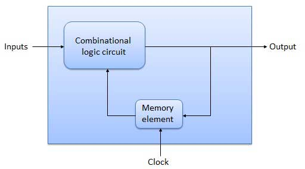

# Digital Sequential Circuits
{: .no_toc }

The combinational circuit does not use any memory. 
Hence the previous state of input does not have any effect on the present state of the circuit. 
But sequential circuit has memory so output can vary based on input. This type of circuits uses previous input, output, clock and a memory element.

This sequential circuit contains a set of inputs and output(s). 
The output(s) of sequential circuit depends not only on the combination of present inputs but also on the previous output(s). 
Previous output is nothing but the present state. 
Therefore, sequential circuits contain combinational circuits along with memory (storage) elements. 
Some sequential circuits may not contain combinational circuits, but only memory elements.

Following table shows the **differences** between combinational circuits and sequential circuits.

|   Combinational Circuits    |    Sequential Circuits     |
|:----------------------------|:---------------------------|
|Outputs depend only on present inputs.|Outputs depend on both present inputs and present state.|
|Feedback path is not present.|Feedback path is present.|
|Memory elements are not required.|Memory elements are required.|
|Clock signal is not required.	|Clock signal is required.|
|Easy to design.|Difficult to design.|

## Types of Sequential Circuits

Following are the two types of sequential circuits −

* Asynchronous sequential circuits
* Synchronous sequential circuits

### Asynchronous sequential circuits

If some or all the outputs of a sequential circuit do not change (affect) with respect to active transition of clock signal, then that sequential circuit is called as Asynchronous sequential circuit. That means, all the outputs of asynchronous sequential circuits do not change (affect) at the same time. Therefore, most of the outputs of asynchronous sequential circuits are not in synchronous with either only positive edges or only negative edges of clock signal.

### Synchronous sequential circuits

If all the outputs of a sequential circuit change (affect) with respect to active transition of clock signal, then that sequential circuit is called as Synchronous sequential circuit. That means, all the outputs of synchronous sequential circuits change (affect) at the same time. Therefore, the outputs of synchronous sequential circuits are in synchronous with either only positive edges or only negative edges of clock signal.



