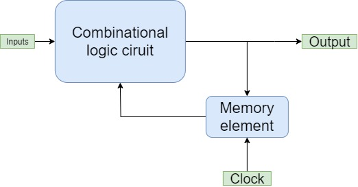

# Digital Sequential Circuits
{: .no_toc }

In Combinational circuits there is no use of any memory. Therfore, The circuit's present state is not affected by the previous state's input.
But, in Sequential circuits there is a memory, so the output can change(affect) based on the input. These types of circuits use a memory element, clock,output, and their previous input.

The above figure's Sequential circuit has some inputs, and some output(s). The output(s) of a sequential circuit does not only depend on combination of the present inputs, but also on the previous output(s). So, we can say that the present state has the previous output also. Hence, Sequential circuits also have Combinational circuits with memory/storage elements, but there are some Sequential circuits which may not contain Combinational circuits, but only memory/storage elements.

The below table shows some **differences** between the Sequential and Combinational circuits.

|   Combinational Circuits    |    Sequential Circuits     |
|:----------------------------|:---------------------------|
|The outputs are dependent only on present inputs.|The outputs are dependent on the present inputs and and also on present state.|
|There is feedback path ..|There is a feedback path.|
|Memory elements aren't necessary.|Memory elements are necessary.|
|The clock signal isn't required.	|The clock signal is required.|
|It easy to design.|It difficult to design.|

## Types of Sequential Circuits

There are 2 types of Sequential circuits−

* Asynchronous Sequential circuits
* Synchronous Sequential circuits

### Asynchronous Sequential Circuits

Asynchronous Sequential circuits are Sequential circuits, in which the some/all outputs don't change(affect) with the the active transition of the clock signal, which means the outputs of these circuits do not change(affect) at same time. Hence, most outputs of these circuits are not in Synchronous with- only positive(+) edges or negative(-) edges of the Clock signal.

### Synchronous sequential circuits

Synchronous Sequential circuits are Sequential circuits, in which all the outputs change(affect) with the the active transition of the Clock signal, which means the outputs of these circuits change(affect) at same time. Hence, the outputs of these circuits are in synchronous with- only positive(+) edges or negative(-) edges of the Clock signal.



