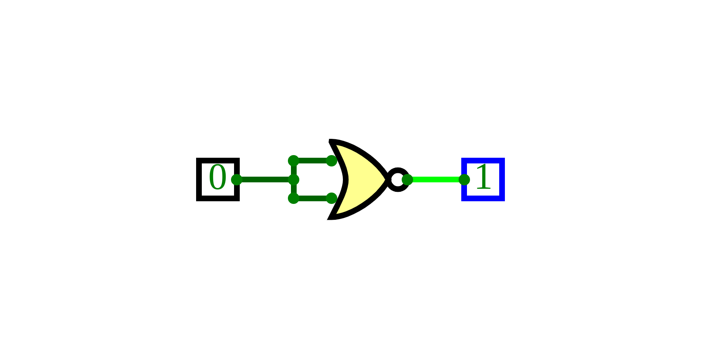
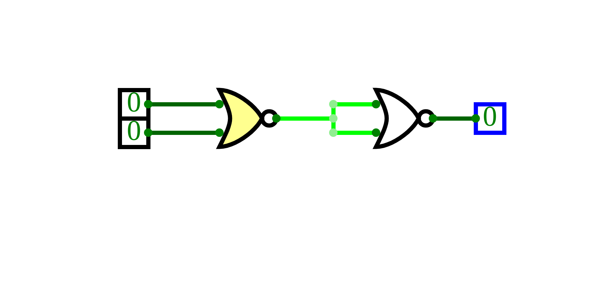
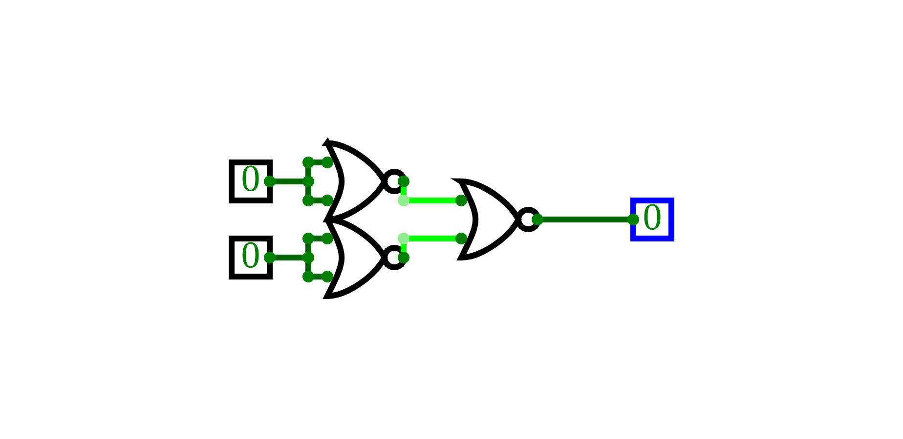
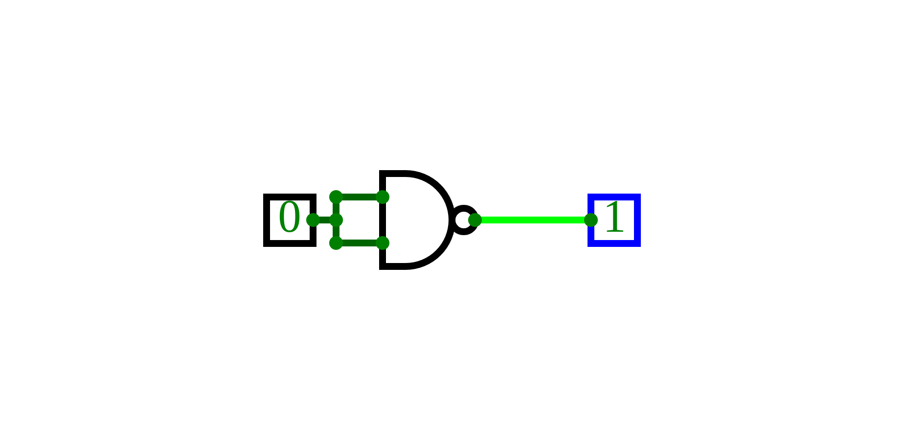

# Universal Gates
{: .no_toc }

## Table of contents
{: .no_toc .text-delta }

1. TOC
{:toc}

---

## Introduction

Universal gates are gates which can be used to implement all other gates.
This is useful as manufacturers only need to produce 1 type of universal gate to be able to use all other gates.

The universal gates are NOR and NAND.
This page will show you how to implement AND, OR and NOT gates using universal gates.
The AND, OR and NOT gates are basic gates that are commonly used and are very important.

## NOR gate
The NOR gate is the opposite of the OR gate. It is like an OR gate followed by a NOT gate.

### Implementing NOT gate
A NOT gate can be implemented by passing the same input into both inputs of the NOR gate.

<iframe width="600px" height="400px" src="https://circuitverse.org/simulator/embed/45175" id="projectPreview" scrolling="no" webkitAllowFullScreen mozAllowFullScreen allowFullScreen> </iframe>

### Implementing OR gate
An OR gate can be implemented by passing the output of NOR to the NOT gate we implemented earlier.

<iframe width="600px" height="400px" src="https://circuitverse.org/simulator/embed/45176" id="projectPreview" scrolling="no" webkitAllowFullScreen mozAllowFullScreen allowFullScreen> </iframe>

### Implementing AND gate
Since the NOR gate outputs true only when both inputs are 0, an AND gate can be implemented by inverting the inputs to a NOR gate.

<iframe width="600px" height="400px" src="https://circuitverse.org/simulator/embed/45177" id="projectPreview" scrolling="no" webkitAllowFullScreen mozAllowFullScreen allowFullScreen> </iframe>

## NAND gate
The NAND gate is the opposite of the AND gate. It is like an AND gate followed by a NOT gate.

### Implementing NOT gate
Similarly to NOR, a NOT gate can also be implemented by joining the inputs of a NAND gate.

<iframe width="600px" height="400px" src="https://circuitverse.org/simulator/embed/45178" id="projectPreview" scrolling="no" webkitAllowFullScreen mozAllowFullScreen allowFullScreen> </iframe>

### Implementing OR gate
The only time the NAND gate output is 0 is when both inputs are 1. Therefore, by inverting the inputs of a NAND gate, an OR gate can be implemented.

<iframe width="600px" height="400px" src="https://circuitverse.org/simulator/embed/45179" id="projectPreview" scrolling="no" webkitAllowFullScreen mozAllowFullScreen allowFullScreen> </iframe>

### Implementing AND gate
The AND gate is simply the output of a NAND gate inverted.

<iframe width="600px" height="400px" src="https://circuitverse.org/simulator/embed/45180" id="projectPreview" scrolling="no" webkitAllowFullScreen mozAllowFullScreen allowFullScreen> </iframe>


